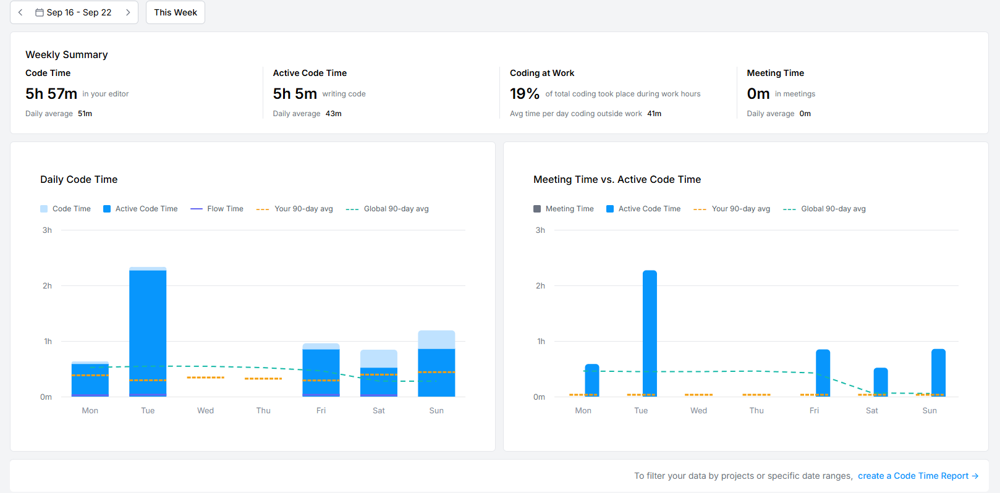

# Rythm Riddle

## 概述

**Rythm Riddle 这歌我熟** 是一款有趣的猜歌游戏，玩家通过聆听一段简短的音频片段来猜测歌曲名称、歌手、专辑、流派。该游戏支持 Android、Windows和Linux 平台，使用 Flutter 开发，以实现跨平台的无缝体验。
**开发中，需要你的[帮助和贡献](#帮助和贡献)！**

## 功能
- [x] **跨平台支持**：在 Android、Windows、Mac 和 Linux 上运行。
- [x] **国际化**：使用i10n实现中英两种语言 
- [ ] **需要被丰富**的音乐库：[想要添加歌曲和歌单？](#更多歌曲和歌单)
- [ ] **玩家社区**：可以自己创建歌单。
- [ ] **单人模式**：目前已实现选择与输入歌曲名、歌手、专辑、流派 (half-finished)。
- [ ] **多人模式**：可以与好友抢答，其它没想好，有想法可以[联系我](#联系方式)。
- [ ] **多难度**：简单、中等、困难。(算法没时间细抠)
- [ ] **自定义选项**：玩家可选择难度，和自定义游戏选项。
  - 音乐播放时长
  - 音乐播放位置
  - 答题方式（填空、选择）
  - 有无提示
  - ... 更多
- [ ] **得分系统**：通过正确猜歌获得积分，与好友竞赛。
- [ ] **排行榜**：与所有玩家竞争，查看分数排行榜。

### 进度：
已完成:
- 登录
- home显示playlist
- home的账户页面
- playlistInfo的大设备&小设备ui
- playlistInfo的跳转至SinglePlayer页面的参数传递
- 搜索页面（半成品）
- singlePlayer逻辑&ui

todo:
- multiPlayer的Everything
- 配置（困难、自定义配置）
- .....

## 使用技术

- **Flutter**：用于跨平台移动和桌面开发的框架。
- **Dart**：Flutter 使用的编程语言。
- **PHP**：后端 API 通过 PHP 与 MySQL 数据库通信。
- **MySQL**：用于存储用户数据、歌曲信息和游戏进度的数据库。

### 部分编写代码时间记录

## 帮助和贡献
贡献者的会出现在[特别感谢](#特别感谢)中，感谢大家的帮助！
主要代码在/lib中，如果有兴趣但不知道Flutter可以在[官网](https://docs.flutter.cn/get-started/learn-flutter)上看看

### Fork和Pull
欢迎大家贡献代码！如果有任何功能需求、Bug 或建议，请Fork此项目仓库然后提交 Pull Request 或创建 Issue。也可[联系我](#联系方式)。十分需要和感谢你的帮助！

### 更多歌曲和歌单
数据库中的歌曲等较少，需要更多数量和种类的音乐和歌单。为确保数据安全性，仅限我认识的人添加歌曲（管理员权限）。其他人可以[和我联系](#联系方式)，进行添加歌曲。

### 冰美式?热巧? ☕
[来一杯](http://hungryhenry.xyz/reward.html)我会更快的！

## 许可协议
本项目基于GNU General Public License v3.0 许可协议。详情请查看[LICENSE](/LICENSE)文件。
本软件仅供个人学习、研究或非商业用途。禁止将本软件用于任何商业目的, 包括但不限于出售、出租、许可或以其他形式从中获利。

## 联系方式
如有任何问题或建议，请通过以下方式联系我：
- 邮箱：[hungryhenry101@outlook.com](mailto:hungryhenry101@outlook.com)
- B站：[HungryHenry](https://space.bilibili.com/672872726)

## 特别感谢
- Spidy: 一杯冰美式
- Yueran: 一杯冰美式