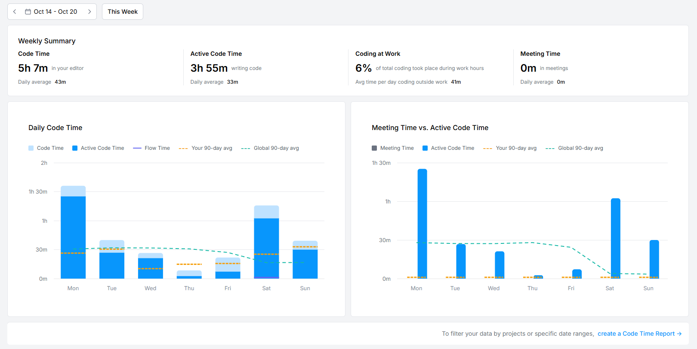

# 🎵 Rhythm Riddle

一款有趣的猜歌游戏，让音乐爱好者通过聆听音频片段来测试他们的音乐知识！

[English](#english) | [中文](#概述)

## 📝 概述

**Rhythm Riddle 这歌我熟** 是一款有趣的猜歌游戏，玩家通过聆听一段简短的音频片段来猜测歌曲名称、歌手、专辑、流派。该游戏支持 Android、Windows和Linux 平台，使用 Flutter 开发，以实现跨平台的无缝体验。

> **Note:** 项目正在开发中，需要你的[帮助和贡献](#帮助和贡献)！

## ✨ 功能

### 已完成 ✅
- **跨平台支持**：在 Android、Windows、Mac 和 Linux 上运行
- **国际化**：使用i10n实现中英两种语言
- **登录功能**
- **主页显示歌单**
- **账户页面**
- **歌单信息页面**（支持大设备和小设备UI）
- **单人模式**（基础功能）
- **搜索页面**（半成品）

### 开发中 🚧
- **音乐库扩充**：[想要添加歌曲和歌单？](#更多歌曲和歌单)
- **玩家社区**：可以自己创建歌单
- **多人模式**：与好友抢答
- **多难度系统**：简单、中等、困难
- **自定义选项**：
  - 音乐播放时长
  - 音乐播放位置
  - 答题方式（填空、选择）
  - 有无提示
- **得分系统**：通过正确猜歌获得积分
- **排行榜**：与所有玩家竞争

## 🛠️ 技术栈

- **Flutter**：跨平台移动和桌面开发框架
- **Dart**：Flutter 使用的编程语言
- **PHP**：后端 API 开发
- **MySQL**：数据存储

## 📊 开发进度

## 🤝 帮助和贡献

我们欢迎任何形式的贡献！贡献者的名字会出现在[特别感谢](#特别感谢)中。

### 如何贡献
1. Fork 本仓库
2. 创建你的特性分支 (`git checkout -b feature/AmazingFeature`)
3. 提交你的更改 (`git commit -m 'Add some AmazingFeature'`)
4. 推送到分支 (`git push origin feature/AmazingFeature`)
5. 开启一个 Pull Request

### 添加歌曲
数据库需要更多数量和种类的音乐和歌单。为确保数据安全性，仅限管理员添加歌曲。如需添加歌曲，请[联系我](#联系方式)。

## ☕ 支持项目

喜欢这个项目？[来一杯咖啡](http://hungryhenry.xyz/reward.html)支持开发！

## 📄 许可协议

本项目基于 [GNU General Public License v3.0](LICENSE) 许可协议。

> **注意：** 本软件仅供个人学习、研究或非商业用途。禁止将本软件用于任何商业目的。

## 📞 联系方式

- 📧 邮箱：[hungryhenry101@outlook.com](mailto:hungryhenry101@outlook.com)
- 🎥 B站：[HungryHenry](https://space.bilibili.com/672872726)

## 🙏 特别感谢

- Spidy: 一杯冰美式
- Yueran: 一杯冰美式

---

Made with ❤️ by HungryHenry

